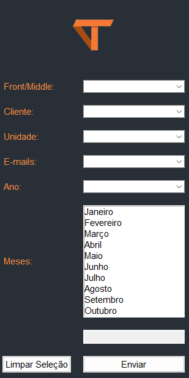

<h1 align="center"> Sistema de Cobrança de Faturas </h1>

Este projeto tem como objetivo principal realizar, uma automação na cobrança de faturas de clientes. 

## 🚀 Tecnologias

Esse projeto foi desenvolvido com as seguintes tecnologias:

- Python
- Pandas
- Tktinter
- Ttk
- Smtplib
- email.mime
- Pillow
- Excel

## 💻 Projeto

## Licença

## Dependências

Ativar o ambiente virtual, no windows.
 

pasta onde criou o seu ambiente virtual\Scripts\activate

# Instalar as dependências

pip install pandas

pip install pillow

python -m venv nome_do_ambiente

 

Esse projeto está sob a licença MIT.

<i>Developer with by</i> Matheus Oliveira .
